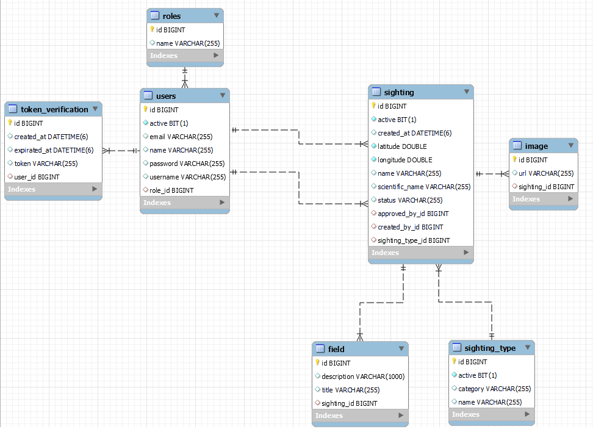

# Reserva - Desarrollo Backend

API - Reserva - registro y vista de avistamientos

# Indice

- [Tecnologías](#Tecnologías)
- [Swagger (probar API)](#Swagger)
- [Diagrama del modelo de datos](#Diagrama-del-modelo-de-datos-MySQL)
- [Roles](#Roles)
- [Endpoints](#Endpoints)


## Tecnologías
<p align="left"> <a href="https://www.java.com" target="_blank" rel="noreferrer">  </a> <a href="https://www.mysql.com/" target="_blank" rel="noreferrer">  </a> <a href="https://postman.com" target="_blank" rel="noreferrer">  </a> <a href="https://spring.io/" target="_blank" rel="noreferrer">  </a> </p>

## Swagger
Despues de haber ejecutado la aplicacion para abrir correctamente swagger:

```
  http://localhost:8000/swagger-ui/index.html#/
```
Para poder probar todos los endpoints necesitas iniciar sesion con el siguiente usuario de prueba:

```http
  POST /account/login
```
```
Request:
  {
  "usernameOrEmail": "admin",
  "password": "admin"
  }

Response:
  {
  "username": "admin",
  "role": "ROLE_PERSONAL_RESERVA",
  "accessToken": "bearer_generated",
  "typeToken": "bearer"
  }
```
Ya con el accesToken disponible hay que copiarlo y pegarlo en la seccion *Available authorizations* de swagger
## Diagrama del modelo de datos `MySQL`



## Roles

En principio, los roles se crean directamente desde la base de datos. Quizás más adelante estaría bueno agregar alguna funcionalidad para no tener que harcodearlos, pero, como en principio los roles requeridos son solamente dos, opté por hardcodearlos. 

#### Data:

| Id        | Name                    | Permissions                |
| :-------- | :---------------------- | :------------------------- |
| `1`       | `ROLE_PERSONAL_RESERVA` | **all**.                   |
| `2`       | `ROLE_USER`             | **limited**.               |

## Endpoints

### Comandos administrativos
Metodos para que el *ROLE_PERSONAL_RESERVA* pueda generar usuarios sin necesidad de pasar por un registro previo y asi poder generar otros usuarios con rol de *ROLE_PERSONAL_RESERVA*.
* ```POST /users/create ``` [Generar un usuario nuevo](#Create)🔒
* ```PUT /users/update/{id} ``` [Editar un usuario ya existente](#Update)🔒
* ```DELETE /users/delete/{id} ``` [Eliminar un usuario](#Delete)🔒
* ```RESTORE /users/restore/{id} ``` [Restaurar un usuario eliminado](#Restore)🔒
* ```GET /users ``` [Traer todos los usuarios](#Create)🔒
* ```GET /users/user/{id} ``` [Traer un ususario por su id](#Create)🔒

### Autenticacion 
Jwt
* ```POST /account/register ``` [Generar un usuario nuevo register](#Generar-un-usuario-nuevo-register)🔓
* ```POST /account/login ``` [Realizar el inicio de sesion de un usuario ya registrado](#Realizar-el-inicio-de-sesion-de-un-usuario-ya-registrado)🔓
* ```POST /account/recovery ``` [Enviar una solicitud de recuperacion de contraseña al email](#Enviar-una-solicitud-de-recuperacion-de-contraseña-al-email)🔓
* ```POST /account/reset-password ``` [Realizar el cambio de contraseña previamente el token verificado](#Realizar-el-cambio-de-contraseña-previamente-el-token-verificado)🔓

### Tipos de avistamientos
Un tipo de avistamiento es la seccion en la que el usuario va a guardar un avistamiento, es decir, si queremos almacenar el avistamiento de un ```Colibrí``` lo vamos a guardar en la seccion de ```Aves``` y asi susecivamente...
* ```POST /sighting/type/create ``` [Generar un tipo de avistamiento nuevo ej Aves, Arboles](#Create)🔒
* ```PUT /sighting/type/update/{id} ``` [Editar un tipo de avistamiento ya existente](#Update)🔒
* ```DELETE /sighting/type/delete/{id} ``` [Eliminar un tipo de avistamiento](#Delete)🔒
* ```RESTORE /sighting/type/restore/{id} ``` [Restaurar un tipo de avistamiento eliminado](#Restore)🔒
* ```GET /sighting/type ``` [Traer todos los tipos de avistamientos](#Create)🔓
* ```GET /sighting/type/{id} ``` [Traer un tipo de avistamiento por su id](#Create)🔓

### Avistamientos
Dentro de **Avistamientos** tenemos distintos endpoints de creacion, actualizacion, y, vistas. A su vez para el ROLE_PERSONAL_RESERVA hay un endpoint para aprobar y/o rechazar avistamientos
* ```POST /sighting/create ``` [Generar un avistamiento nuevo](#Create)🔓
* ```POST /sighting/status ``` [Realizar la actualizacion del estado de un avistamiento](#Create)🔒
* ```GET /sighting ``` [Traer todos los avistamientos](#Create)🔓
* ```GET /sighting/{id} ``` [Traer un avistamiento por su id](#Create)🔓
* ```GET /sighting/getByUser/{userId} ``` [Traer todos los avistamientos de un usuario dado su id](#Create)🔓

---
#### Generar un usuario nuevo register:
```POST /account/register ```

Request:
```JSON
{
  "name": "example",
  "username": "example",
  "email": "example@gmail.com",
  "password": "example"
}
```
Successful response body:

``` body: "SIGN_UP_SUCCESSFUL" ``` ```code: 200 ```

Responses:
| Code      |  Description                |
| :-------- | :------------------------- |
| `200` | SIGN_UP_SUCCESS |
| `400` | ROLE_NOT_FOUND |
| `404` | USERNAME_TAKEN or EMAIL_TAKEN |
| `500` | DATABASE_SAVE_FAILED |

---
#### Realizar el inicio de sesion de un usuario ya registrado:
```POST /account/login ```

Request:
```JSON
{
  "usernameOrEmail": "example",
  "password": "example"
}
```
Successful response body:
```JSON
{
  "username": "example",
  "role": "ROLE_PERSONAL_RESERVA",
  "accessToken": "bearer_generated",
  "typeToken": "bearer"
}
```
Responses:
| Code      |  Description                |
| :-------- | :------------------------- |
| `200` | SIGN_IN_SUCCESS |
| `500` | INVALID_CREDENTIALS |

---
#### Enviar una solicitud de recuperacion de contraseña al email:
```POST /account/recovery ```

Request:
```JSON
{
  "email": "example@example.com",
}
```
Successful response body:
``` body: "EMAIL_SEND_OK" ``` ```code: 200 ```

Email Format:
```
Hola, se solicito un cambio de contraseña:
**link+token**

Recorda que el token es valido solamente por 10 minutos


Saludos,
Reserva.
```
Responses:
| Code      |  Description                |
| :-------- | :------------------------- |
| `200` | EMAIL_SENT_SUCCESSFULLY |
| `404` | EMAIL_NOT_FOUND |
| `500` | EMAIL_SEND_FAILED |

---
#### Realizar el cambio de contraseña previamente el token verificado:
```POST /account/reset-password ```

Request:
```JSON
{
  "token": "token_email",
  "password": "example1",
  "passwordRepeat": "example1"
}
```
Successful response body:
``` body: "PASSWORD_CHANGED" ``` ```code: 200 ```

Responses:
| Code      |  Description                |
| :-------- | :------------------------- |
| `200` | PASSWORD_CHANGED |
| `400` | TOKEN_REQUEST_INVALID |
| `400` | PASSWORD_MISMATCH |
| `403` | INVALID_TOKEN |
| `500` | DATABASE_SAVE_FAILED |
